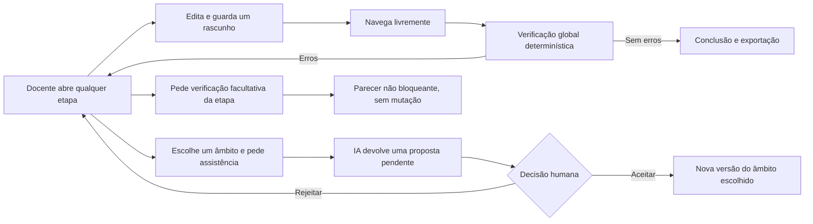

# Arquitetura de autoria manual com IA controlada do CoerIA

## Decisão de arquitetura

O CoerIA adota um fluxo **manual-first**. O estado pedagógico, as versões e a
navegação pertencem à aplicação; um LLM nunca controla a transição entre
etapas. Criar uma sessão inicializa estruturas editáveis vazias para as sete
etapas de autoria. O docente pode abrir, preencher e guardar qualquer uma sem
chave de API.

## Referência pedagógica

O alinhamento e a sequência pedagógica recomendada fundamentam-se em Biggs e
Tang, *Teaching for Quality Learning at University*. Os resultados de
aprendizagem constituem o elemento central; as atividades de
ensino-aprendizagem e as tarefas de avaliação devem mobilizar as ações neles
expressas, e os critérios devem permitir julgar o desempenho alcançado. A
`minutaProgramasUCs.xls` não é uma referência oficial do alinhamento nem do
fluxo do CoerIA.

## Fronteiras de autoridade

- O **docente** escolhe a etapa, o âmbito entregue à IA e a decisão de aceitar
  ou rejeitar cada proposta.
- A **aplicação** conserva o estado, versões, dependências, auditoria e
  verificadores determinísticos.
- O **gerador especialista** só é executado a pedido e apenas fornece uma
  proposta. Não persiste nem aprova conteúdo.
- O **crítico pedagógico** só é executado a pedido, devolve avisos ou problemas
  e não reescreve o artefacto.
- A **verificação global** é determinística e constitui a única barreira
  obrigatória à conclusão.

## Estado e navegação

As novas sessões usam `orchestration.mode = "manual-first"` e guardam desde o
início um artefacto estrutural para cada etapa de autoria. `current_stage` é um
ponteiro de navegação, não uma autorização para gerar conteúdo. Abrir uma etapa
não valida completude, não cria uma versão e não chama um fornecedor.

Guardar uma edição manual:

1. confirma apenas o tipo estrutural da raiz;
2. preserva uma fotografia para rastreabilidade;
3. cria uma nova versão com autoria `Docente`;
4. conserva todos os artefactos posteriores;
5. marca como `needs_review` os artefactos posteriores que já contêm trabalho;
6. invalida apenas o resultado derivado da verificação final.

Esta estratégia permite rascunhos incompletos e evita perda de trabalho quando
uma decisão anterior muda.

## Assistência localizada

Antes da chamada, a interface deriva uma lista de âmbitos a partir do editor da
etapa: etapa completa, tabela, linha, campo escalar ou célula de uma linha. O
docente escolhe um desses âmbitos e escreve a instrução. Embora o agente possa
receber o artefacto ativo como contexto de leitura, a resposta fica limitada por
um esquema JSON derivado exatamente do caminho escolhido. Uma célula devolve um
valor, uma linha devolve um único objeto e uma tabela devolve apenas a respetiva
lista. Só o âmbito «etapa completa» usa o gerador integral; nunca se seleciona o
mesmo índice numa nova lista produzida pelo modelo.

Cada proposta persistida contém:

- identificador, data, etapa e caminho do âmbito;
- instrução do docente;
- valor anterior e valor proposto;
- fornecedor, modelo e métricas disponíveis;
- estado `pending`, `accepted` ou `rejected`.

Uma proposta pendente não altera o artefacto ativo. Aceitar substitui apenas o
caminho autorizado e guarda uma nova versão; rejeitar altera somente o estado
da proposta.

## Restauro de versões

O histórico é imutável: restaurar altera o ponteiro ativo para uma entrada
existente e não apaga nem duplica versões. O docente seleciona uma versão não
ativa, consulta o impacto e confirma, sem ter de justificar a operação. O CoerIA
carrega esse artefacto como versão ativa, assinala os artefactos posteriores
preenchidos para revisão e remove o relatório final derivado. As dependências a
montante não são revertidas silenciosamente e serão verificadas novamente na
validação global. `final_validation` não é restaurável porque pode ser
recalculada localmente.

## Verificação facultativa por IA

O crítico recebe a etapa ativa e os artefactos relevantes, mas não tem uma
ferramenta de escrita. O parecer estruturado, as instruções de revisão e os
metadados ficam em `ai_reviews[stage]` com `non_blocking = true`. O docente pode
continuar independentemente de o parecer conter avisos ou problemas.

## Verificação global obrigatória

Ao abrir a oitava etapa, o CoerIA executa localmente os validadores das sete
etapas de autoria, a compatibilidade entre taxonomia, nível e verbo, o estado da
matriz e a qualidade dos recursos. O relatório identifica cada controlo e só
permite concluir quando todos passam. Pedir ou não uma segunda opinião a um LLM
não altera este resultado.

O relatório só cria uma versão quando o seu conteúdo muda ou quando ainda não
existe uma versão ativa. Abrir, sair e regressar sem alterações não acrescenta
ruído ao histórico. Depois da conclusão, a barra é apenas informativa; reabrir a
autoria requer uma ação separada, etapa, motivo e confirmação explícita.

## Recursos e imagens

Quando a assistência abrange toda a etapa de recursos, cada tipo selecionado
continua a ser gerado e validado separadamente. Num âmbito inferior, a IA devolve
somente a tabela, linha ou campo escolhido e não dispara geração de imagens. As
imagens geradas numa proposta integral permanecem fora da chamada estrutural e
só são associadas ao estado se a proposta correspondente for aceite. A geração
de imagens exige consentimento explícito e `OPENAI_API_KEY`.

## Fontes extensas

A ingestão e extração documental são locais. Acima do orçamento normal de
contexto, a criação da sessão conserva o texto e regista a redução como adiada,
em vez de fazer uma chamada implícita. Assim, a independência de LLM abrange
também a fase anterior à primeira etapa.

Quando o docente pede a primeira assistência ou crítica, a redução adiada é
executada antes da operação, o texto original continua preservado e apenas a
versão reduzida entra no contexto do modelo. A redução e a operação pedida são
persistidas em conjunto quando terminam com sucesso.

## Abstração do fornecedor

O docente pode associar OpenAI ou IAedu à sessão. Esta escolha não implica uma
chamada na criação nem exige que a chave exista nessa altura. A chave só é
consultada quando o docente pede uma operação de IA. A OpenAI usa a Responses
API com saídas estruturadas; o adaptador IAedu conserva a mesma interface
interna e entrega os resultados aos mesmos esquemas e guardrails.

## Migração e rastreabilidade

Sessões anteriores são migradas para o esquema 16 sem apagar artefactos ou
versões. O ponto corrente é preservado, as estruturas ausentes são inicializadas
vazias e estados antigos como `stale` passam a `needs_review`. As propostas e
pareceres futuros ficam separados em `ai_proposals` e `ai_reviews`.

A camada `ApplicationService` coordena navegação, edição, assistência,
verificação e persistência. A interface NiceGUI não executa regras pedagógicas
nem chama diretamente fornecedores. Esta separação mantém o domínio testável
sem navegador e permite substituir a interface sem alterar a autoridade do
docente.

## Configuração relevante

- `COERIA_OPENAI_MODEL`: modelo do gerador OpenAI;
- `COERIA_OPENAI_CRITIC_MODEL`: modelo usado na verificação facultativa;
- `COERIA_OPENAI_RESOURCE_MODEL`: substituição específica para recursos;
- `COERIA_OPENAI_REASONING_EFFORT`: esforço para modelos compatíveis;
- `COERIA_RESOURCE_QUALITY_MAX_REVISIONS`: correções internas limitadas de um
  recurso pedido explicitamente;
- `COERIA_AI_PROVIDER`: fornecedor inicialmente mostrado na interface;
- `COERIA_IAEDU_ENDPOINT` e `COERIA_IAEDU_CHANNEL_ID`: configuração IAedu.
