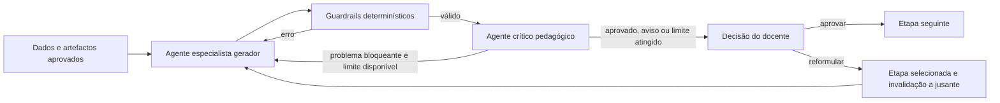

# Arquitetura agentic controlada do CoerIA

## Decisão de arquitetura

O CoerIA mantém o macrofluxo pedagógico explícito em LangGraph e introduz um
microciclo agentic apenas dentro das etapas em que uma segunda apreciação traz
valor. Esta solução conserva a sequência sustentada pela dissertação, evita que
o modelo salte etapas e permite auditar cada decisão.

## Papéis e autoridade

- O **gerador especialista** produz uma proposta estruturada segundo o papel da
etapa: análise curricular, resultados, classificação SOLO ou Bloom, avaliação,
design, atividades formativas,
  alinhamento ou recursos.
- Os **guardrails determinísticos** verificam IDs, cobertura, cardinalidades,
  escolha exclusiva e vocabulário da taxonomia, verbo único, finalidade das
  avaliações, ligações e somas. Uma falha provoca reparação automática e
  limitada antes de a proposta ser apresentada.
- O **crítico pedagógico** aprecia coerência, exigência cognitiva, clareza,
  exequibilidade e fidelidade aos dados. Pode pedir uma reformulação automática,
  mas não aprova a etapa.
- O **docente** é a única entidade com autoridade para aprovar, regressar a uma
  componente ou concluir o processo no ecrã de validação final.

## Limites e falhas

O número de reparações de esquema e de revisões do crítico é configurável. Ao
atingir o limite, a aplicação não entra num ciclo infinito: apresenta a melhor
proposta válida e as observações ao docente. Se o crítico estiver indisponível,
a geração estruturalmente válida continua para revisão humana e a falha fica
registada nos metadados. Uma falha do gerador não é substituída por conteúdo
local silencioso.

## Abstração do fornecedor

Antes de iniciar uma sessão, o docente escolhe OpenAI ou IAedu. O gerador, o
crítico e a proposta de preenchimento inicial usam sempre esse mesmo fornecedor.
A escolha fica no estado persistido e no manifesto de exportação.

A OpenAI fornece diretamente saídas estruturadas pela Responses API. O adaptador
IAedu conserva a mesma interface interna: envia um pedido multipart para o agente,
recompõe os eventos de streaming do tipo `token`, extrai o objeto JSON e entrega-o
aos mesmos esquemas e guardrails determinísticos. Assim, mudar de fornecedor não
altera o macrofluxo pedagógico nem a autoridade do docente.

## Rastreabilidade

Cada etapa conserva versões do artefacto e metadados dos turnos de geração e
crítica: papel, modelo, identificador de resposta, duração, tokens, observações e
número de reformulações. O rasto de auditoria regista também as decisões e o
feedback humano.

## Camada de interface

A interface NiceGUI não executa diretamente regras pedagógicas. A camada
`ApplicationService` coordena os casos de uso e devolve apenas dados Python,
enquanto o workflow LangGraph permanece como fonte de verdade das transições.
Esta separação permite testar o domínio sem navegador e substituir futuramente
a interface sem alterar agentes, persistência ou validações.

## Porque não foi acrescentado outro runtime

A aplicação já controla estado, versões, retoma e transições com LangGraph. As
APIs dos fornecedores são usadas apenas para gerar e criticar conteúdo dentro
desse controlo explícito. Introduzir simultaneamente um segundo runtime de
orquestração criaria duas fontes de verdade para sessão, transições e
persistência. O Agents SDK
poderá ser avaliado futuramente se o objetivo passar a ser delegação dinâmica,
ferramentas externas ou execuções longas geridas pelo próprio runtime.

## Configuração

- `COERIA_AGENTIC_CRITIC_ENABLED`: ativa ou desativa o crítico;
- `COERIA_AGENTIC_CRITIC_STAGES`: etapas submetidas ao crítico;
- `COERIA_AGENTIC_MAX_REVISIONS`: reformulações máximas pedidas pelo crítico;
- `COERIA_OPENAI_CRITIC_MODEL`: modelo do crítico;
- `COERIA_OPENAI_CRITIC_MAX_OUTPUT_TOKENS`: limite da crítica estruturada.
- `COERIA_RESOURCE_QUALITY_MAX_REVISIONS`: reformulações automáticas dos
  recursos após falhas de qualidade;
- `COERIA_OPENAI_ASSISTANT_MAX_OUTPUT_TOKENS`: limite da proposta inicial
  pedida pelo docente.
- `COERIA_AI_PROVIDER`: fornecedor inicialmente selecionado na interface;
- `COERIA_IAEDU_ENDPOINT`: endpoint do agente IAedu;
- `COERIA_IAEDU_CHANNEL_ID`: canal IAedu;
- `COERIA_IAEDU_TIMEOUT_SECONDS` e `COERIA_IAEDU_MAX_RETRIES`: limites de
  comunicação IAedu.

## Referências técnicas oficiais

- [A practical guide to building agents](https://openai.com/business/guides-and-resources/a-practical-guide-to-building-ai-agents/)
- [OpenAI Agents SDK: Agents SDK or Responses API?](https://openai.github.io/openai-agents-python/)
- [Tracing in the OpenAI Agents SDK](https://openai.github.io/openai-agents-python/tracing/)
- [IAedu: exemplo Python da API](https://docs.iaedu.pt/books/funcionalidade-api/page/exemplo-python)
