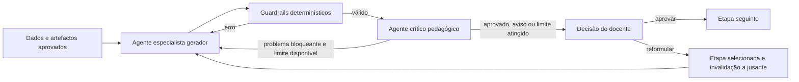

# Arquitetura agentic controlada do CoerIA

## Decisão de arquitetura

O CoerIA mantém o macrofluxo pedagógico explícito em LangGraph e introduz um
microciclo agentic apenas dentro das etapas em que uma segunda apreciação traz
valor. Esta solução conserva a sequência sustentada pela dissertação, evita que
o modelo salte etapas e permite auditar cada decisão.

## Papéis e autoridade

- O **gerador especialista** produz uma proposta estruturada segundo o papel da
etapa: análise curricular, resultados, classificação SOLO ou Bloom, avaliação,
design, atividades formativas,
  alinhamento ou recursos.
- Os **guardrails determinísticos** verificam IDs, cobertura, cardinalidades,
  escolha exclusiva e vocabulário da taxonomia, verbo único, finalidade das
  avaliações, ligações e somas. Uma falha provoca reparação automática e
  limitada antes de a proposta ser apresentada.
- O **crítico pedagógico** aprecia coerência, exigência cognitiva, clareza,
  exequibilidade e fidelidade aos dados. Pode pedir uma reformulação automática,
  mas não aprova a etapa.
- O **docente** é a única entidade com autoridade para aprovar, regressar a uma
  componente ou concluir o processo no ecrã de validação final.

## Limites e falhas

O número de reparações de esquema e de revisões do crítico é configurável. Ao
atingir o limite, a aplicação não entra num ciclo infinito: apresenta a melhor
proposta válida e as observações ao docente. Se o crítico estiver indisponível,
a geração estruturalmente válida continua para revisão humana e a falha fica
registada nos metadados. Uma falha do gerador não é substituída por conteúdo
local silencioso.

## Abstração do fornecedor

Antes de iniciar uma sessão, o docente escolhe OpenAI ou IAedu. O gerador, o
crítico e a proposta de preenchimento inicial usam sempre esse mesmo fornecedor.
A escolha fica no estado persistido e no manifesto de exportação.

A OpenAI fornece diretamente saídas estruturadas pela Responses API. O adaptador
IAedu conserva a mesma interface interna: envia um pedido multipart para o agente,
recompõe os eventos de streaming do tipo `token`, extrai o objeto JSON e entrega-o
aos mesmos esquemas e guardrails determinísticos. Assim, mudar de fornecedor não
altera o macrofluxo pedagógico nem a autoridade do docente.

## Rastreabilidade

Cada etapa conserva versões do artefacto e metadados dos turnos de geração e
crítica: papel, modelo, identificador de resposta, duração, tokens, observações e
número de reformulações. O rasto de auditoria regista também as decisões e o
feedback humano.

Cada versão regista ainda as versões ativas dos artefactos anteriores que lhe
serviram de entrada. Selecionar uma etapa anterior altera apenas o estado
temporário de navegação da interface; não modifica nem persiste a sessão. Já na
página da etapa, o docente pode escolher **Reformular**. O sistema apresenta o
impacto antes de executar a alteração, guarda uma fotografia coerente do estado
anterior e marca como desatualizadas as etapas dependentes. Estas propostas não
são apagadas: permanecem consultáveis no histórico, mas deixam de estar ativas
até serem novamente geradas ou validadas. Uma sessão anteriormente concluída
regressa assim ao fluxo de autoria e exige uma nova validação final.

A mesma fronteira transacional aplica-se à edição manual. A área da tabela troca
da representação de consulta para controlos editáveis no mesmo local, trabalhando
sobre uma cópia temporária da versão ativa. Os controlos mantêm os campos
pedagógicos visíveis e a respetiva ordem, enquanto as relações técnicas que não
são apresentadas permanecem no modelo interno. As referências a artefactos
anteriores são escolhidas a partir de opções derivadas do estado ativo, em vez
de serem introduzidas como texto livre, e a tabela não acrescenta numeração
visual de linhas. É possível alterar células, adicionar linhas e remover linhas.
Só a ação **Guardar nova versão** executa as validações,
persiste o artefacto com metadados de autoria humana e invalida a cadeia
dependente. Uma falha de validação conserva tanto a sessão como o formulário de
edição inline, e não origina qualquer chamada ao fornecedor de IA.

## Camada de interface

A interface NiceGUI não executa diretamente regras pedagógicas. A camada
`ApplicationService` coordena os casos de uso e devolve apenas dados Python,
enquanto o workflow LangGraph permanece como fonte de verdade das transições.
Esta separação permite testar o domínio sem navegador e substituir futuramente
a interface sem alterar agentes, persistência ou validações.

O fluxo pode emitir mensagens opcionais de progresso nos limites reais da
geração, validação de qualidade e preparação para revisão. Como a geração corre
fora do ciclo da interface, estas mensagens atravessam uma fila segura e são
consumidas periodicamente pela interface, juntamente com o tempo decorrido e um
único indicador indeterminado. Não é calculada uma percentagem fictícia.
Na ausência temporária de uma nova fase reportada, a interface substitui a
mensagem por um estado de espera explícito, sem confundir tempo decorrido com
percentagem concluída.

Na etapa de recursos, a unidade de execução é o tipo de recurso selecionado. A
apresentação, a ficha de aula, o teste e a atividade prática são gerados e
validados separadamente, pela ordem mostrada ao docente. A interface comunica o
tipo corrente e a posição `n/N` usando o mesmo indicador indeterminado. Uma falha
de qualidade repete apenas o recurso afetado; no fim, o conjunto agregado é
novamente verificado antes da revisão humana. O esquema enviado ao fornecedor
contém apenas o recurso corrente: `selected_types`, os campos vazios dos outros
recursos e a agregação final são controlados deterministicamente pela aplicação.
Assim, o modelo não pode alterar a seleção do docente e a resposta não transporta
estruturas desnecessárias. A futura geração de imagens é uma operação distinta
da geração textual e estrutural da apresentação.

Quando uma chamada falha, as propostas dos tipos anteriores que já passaram a
validação são persistidas como rascunhos técnicos, sem aprovar a etapa nem alterar
os artefactos pedagógicos ativos. O rascunho inclui uma impressão digital da
seleção e de todas as entradas relevantes. Na tentativa seguinte, só é
reutilizado se essa impressão digital continuar igual; caso contrário, é
ignorado. Depois da geração completa, os rascunhos são removidos. Para o teste,
a aplicação deriva ainda os IDs técnicos das questões e `total_points`, enquanto
a cobertura dos resultados e o conteúdo pedagógico continuam sujeitos ao modelo,
aos guardrails e à revisão humana. Na atividade prática, outro guardrail filtra
IDs desconhecidos, ordena as etapas, cria uma etapa explícita a partir do
enunciado aprovado de cada resultado ainda não coberto e normaliza
proporcionalmente os pesos dos critérios para totalizarem 100%. As correções são
registadas nos metadados e não dispensam a revisão humana.

Nas etapas de classificação e matriz de alinhamento, a interface deriva a
taxonomia do estado da sessão, não a repete em cada linha e apresenta o nível
através de opções numeradas. O seletor mostra `SOLO 2`–`SOLO 5` ou
`Bloom 1`–`Bloom 6`, mantendo no artefacto o nome canónico do nível e a taxonomia
escolhida.

## Porque não foi acrescentado outro runtime

A aplicação já controla estado, versões, retoma e transições com LangGraph. As
APIs dos fornecedores são usadas apenas para gerar e criticar conteúdo dentro
desse controlo explícito. Introduzir simultaneamente um segundo runtime de
orquestração criaria duas fontes de verdade para sessão, transições e
persistência. O Agents SDK
poderá ser avaliado futuramente se o objetivo passar a ser delegação dinâmica,
ferramentas externas ou execuções longas geridas pelo próprio runtime.

## Configuração

O perfil OpenAI predefinido privilegia o custo durante o desenvolvimento: o
gerador das etapas do programa e o crítico usam
[`gpt-5-nano`](https://developers.openai.com/api/docs/models/gpt-5-nano) com
raciocínio `minimal`. A geração dos recursos usa
[`gpt-4o-mini`](https://developers.openai.com/api/docs/models/gpt-4o-mini), sem o
parâmetro de raciocínio, para obter maior robustez no cumprimento dos esquemas e
das ligações aos resultados de aprendizagem sem aumentar o custo das restantes
etapas. A etapa de recursos fica fora do ciclo gerador–crítico por predefinição,
pois já dispõe de validação determinística separada e aprovação humana. Esta
opção evita uma segunda chamada de modelo por recurso e pode ser alterada nas
variáveis abaixo.

- `COERIA_AGENTIC_CRITIC_ENABLED`: ativa ou desativa o crítico;
- `COERIA_AGENTIC_CRITIC_STAGES`: etapas submetidas ao crítico;
- `COERIA_AGENTIC_MAX_REVISIONS`: reformulações máximas pedidas pelo crítico;
- `COERIA_OPENAI_CRITIC_MODEL`: modelo do crítico;
- `COERIA_OPENAI_MODEL`: modelo do gerador OpenAI;
- `COERIA_OPENAI_RESOURCE_MODEL`: modelo usado apenas na geração dos recursos;
- `COERIA_OPENAI_REASONING_EFFORT`: esforço de raciocínio usado pelo gerador e
  pelo crítico OpenAI;
- `COERIA_OPENAI_CRITIC_MAX_OUTPUT_TOKENS`: limite da crítica estruturada.
- `COERIA_RESOURCE_QUALITY_MAX_REVISIONS`: reformulações automáticas dos
  recursos após falhas de qualidade;
- `COERIA_OPENAI_ASSISTANT_MAX_OUTPUT_TOKENS`: limite da proposta inicial
  pedida pelo docente.
- `COERIA_AI_PROVIDER`: fornecedor inicialmente selecionado na interface;
- `COERIA_IAEDU_ENDPOINT`: endpoint do agente IAedu;
- `COERIA_IAEDU_CHANNEL_ID`: canal IAedu;
- `COERIA_IAEDU_TIMEOUT_SECONDS` e `COERIA_IAEDU_MAX_RETRIES`: limites de
  comunicação IAedu.

## Referências técnicas oficiais

- [A practical guide to building agents](https://openai.com/business/guides-and-resources/a-practical-guide-to-building-ai-agents/)
- [OpenAI Agents SDK: Agents SDK or Responses API?](https://openai.github.io/openai-agents-python/)
- [Tracing in the OpenAI Agents SDK](https://openai.github.io/openai-agents-python/tracing/)
- [IAedu: exemplo Python da API](https://docs.iaedu.pt/books/funcionalidade-api/page/exemplo-python)
